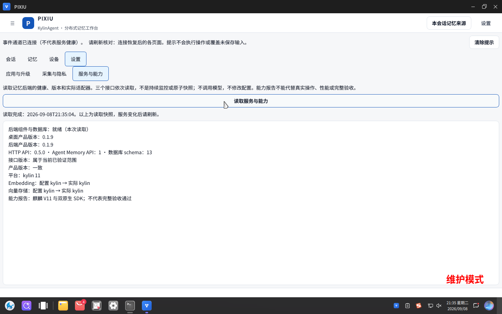

# 2026-09-08 交付实物与 V11 运行版本审查

本记录用于内部整改追踪，不新增赛事必交件。唯一要求为
[DELIVERY_PLAN §0](../DELIVERY_PLAN.md#0-赛方交付作品要求唯一权威永久冻结)，该冻结节未修改。
审查基线为工作区提交 `a7f0181`、产品 `0.1.9`；视频按用户要求不做内容审查。

**结论：三类非视频作品均未就绪，不能直接提交。虚拟机已安装最新产品实现，但原先
运行的是被升级替换的旧 GUI 文件；本次已正常退出并启动新 GUI，确认进程与安装文件
摘要一致。材料整改与最终赛事场景验证尚未完成。**

## 1. 实际检查范围与方法

- 直接读取冻结交付规则、赛题文字、验收规范、主计划、架构/API 和模块文档。
  对赛方 `完整赛题要求.pptx` 实际提取文字、渲染并亲自查看全部 26 页。
- 对交付项目 PPT 的全部 8 页、8 份 PDF 的全部 31 页逐页读文和观察画面；
  另将 DOCX 独立渲染为 14 页逐页查看，未仅依赖 Markdown 或文件存在性。
- 检查 Office 媒体与核心属性：PPT 仅有 1 张嵌入 PNG，单独查看原图；DOCX 无媒体。
  核心作者字段为空，但这不能抵消正文和页脚的实名信息。
- 查看截图清单、素材索引和空画廊；展开源码归档，亲自查看其中全部 77 张
  `frontend/docs/screenshots/` PNG，确认均为旧小窗口/浮球/侧栏时代素材。
- 逐文件比较当前 Git 跟踪内容与源码归档；核对归档 VERSION、子模块实体、身份信息
  和过期材料。该步骤是源码完整性及交付审查，不是逐行代码审计，也不宣称逐页审阅
  归档中的第三方开发手册及每个上游文档。
- 通过真实 V11 桌面及 SSH 读取安装清单、进程、API、文件摘要和用户态 Provider。
  本次没有用生成图片、模拟界面或改写数据库构造演示结果。

机器可复核清单见 [audit-2026-09-08.json](audit-2026-09-08.json)。

## 2. 四项作品逐项结论

| 作品 | 当前实物 | 结论与主要缺口 |
|---|---|---|
| 项目报告 1 份 | `submission/01-项目报告/PIXIU项目报告.pptx`，8 页 | 不通过：每页页脚有学校名称，首页实名署名；标为 0.1.8；产品体验图没有产品界面；核心能力与当前统一宿主实现说明不足 |
| 技术方案 1 份 | `submission/02-技术方案及测试结果/PIXIU技术方案及测试结果.docx`、同名 PDF/MD | 不通过：首页学校/团队信息；0.1.8 旧稿；没有操作截图；安装指南未完整汇入；缺少对比实验设计及同版量化分析 |
| 功能演示视频 1 份 | 本次 `submission/` 文件清单未发现视频或演示 ZIP | 按用户要求排除内容审查；不对时长、大小和功能覆盖给出通过结论 |
| 完整源代码及技术规范 1 份 | `submission/03-源代码及规范/Project.PIXIU-source.tar.gz` | 不通过：内部 VERSION 为 0.1.7，缺失最新实现，混入旧截图、旧规范和身份信息 |

目录也未就绪：当前仍为 `00/01/02/03/04` 工作稿结构，没有 §0.2 指定的两层同名
目录和与内层同级的 `源代码/`。不得把内部各 PDF、安装包和原始证据另列为必交件，
也不得把 Word 与 PDF 各一份说成强制要求。最终材料应按 §0.4 的完整名称组装。

`submission/00-交付说明.md` 仍使用 D-01～D-05、附件 A-01～A-05 及旧视频口径；
它不能作为当前交付指南。README 和支持任务中的过时“五类”入口已在本次修正，
交付实物本身尚未重建。

## 3. 项目报告逐页观察

| 页 | 观察结果 | 必要整改 |
|---|---|---|
| 1 | 版本 0.1.8；学校出现在署名和页脚 | 依据候选版本重写，移除作品内容的身份信息 |
| 2 | 解释跨会话、工具、设备记忆痛点，仍有学校页脚 | 保留准确问题描述，完成匿名检查 |
| 3 | 产品定位和能力关键词，缺少实际操作证明 | 对应当前统一宿主的真实行为与边界 |
| 4 | 分层架构示意 | 更新唯一宿主内嵌工作区、API 0.5、schema 13 等当前事实 |
| 5 | 三设备网络图；粗横线穿过设备 B 标签；删除防复活文字 | 修正排版，区分协议测试与三台设备实证 |
| 6 | “产品体验”嵌图实际是旧桌面终端，显示 `hostname -I` 和重复测试字符，无 PIXIU 主窗口 | 必须替换为当前候选真实产品截图，并检查敏感信息 |
| 7 | 100% 召回、100% 偏好、96% 冲突、115ms P95；备注说明历史 Debian portable | 不能当作同版 V11 最终成绩；补正式数据集、对比实验、原生结果与分析 |
| 8 | 创新与应用价值概述 | 用实际场景结果支撑价值，补明确记忆流转与适配结论 |

8 页都有学校页脚。现有内容提到若干能力，不等于已系统阐述多源整合、动态偏好
及版本化、结构化检索、轻量部署、敏感过滤和真实案例的完整实现与验证。

## 4. 技术方案及分篇文档逐份观察

以下路径均相对于 `submission/`；页数为本次实际渲染/读取结果。

| 文件 | 页数 | 观察与缺口 |
|---|---:|---|
| `02-技术方案及测试结果/PIXIU技术方案及测试结果.pdf` | 13 | 首页实名；架构仍写独立控制台；无任何用户操作图；测试指标是历史 portable；安装说明仅概括，没有完整安装步骤 |
| 同名 `.docx` | 14 | 独立打开后仍为同一旧内容；无内嵌媒体；与 PDF 的分页、重复表头和文本提取顺序不同，不宜仅按文本字节断言正文漂移 |
| `02-技术方案及测试结果/01-用户手册/PIXIU用户手册.pdf` | 3 | 比主稿更早更新为统一入口并承认截图待补，但没有实际截图；未同步汇回主技术方案 |
| `02-技术方案及测试结果/02-效果与测试证据/PIXIU效果与测试报告.pdf` | 3 | 数据集 50 检索/15 偏好/25 冲突、1000 延迟样本；历史结果与最终验证有区分，但没有同版完整对比实验与分析 |
| `02-技术方案及测试结果/03-记忆流转说明/PIXIU记忆流转说明.pdf` | 2 | 描述短中长期、写入、召回、晋升及删除传播；缺少最新持久化 outbox 的说明及真实操作证据 |
| `02-技术方案及测试结果/04-实际应用案例/PIXIU实际应用案例.pdf` | 2 | 两个案例是文字流程，没有可核对的本次操作输入、结果及截图；图片 OCR 的描述须与当前包实际能力核对 |
| `02-技术方案及测试结果/05-V11适配报告/PIXIU银河麒麟V11适配报告.pdf` | 3 | 明确表格是历史候选；不能替代最终 0.1.9 的全场景原生验证 |
| `03-源代码及规范/源码规范与许可证.pdf` | 2 | 已正确警告 tar 为历史归档，但警告本身不能使旧源码变完整 |
| `04-部署文档/PIXIU部署指南.pdf` | 3 | 有安装、启动、服务和排障步骤，但软件包及版本仍指向 0.1.8；该内容未完整汇入主技术方案 |

全部 PDF 可以打开，正文基本可读；主稿有跨页拆表，部分页有大块留白。
重建后应再次实际打开 Word/PDF 检查表头、分页和插图可读性，不能仅重导出通过即交付。

### 最新实现尚未完整纳入

1. 当前产品为唯一 Agent 主窗口，包含“会话、记忆、设备、设置”；主技术方案仍描述
   KylinAgent 加独立 PIXIU 控制台。当前管理页代码在 `frontend/management/`。
2. 当前 `/forget` 使用绑定目标和版本的一次性预览凭证，失效后必须重新预览；
   Agent 不可自动代替用户确认执行。手册应准确说明当前人工界面路径及失败恢复。
3. 管理页已有正文编辑与版本冲突保护、来源阅读、偏好历史与只读冲突审计；不能
   用旧页名或暗示存在尚未实现的人工裁决/偏好回滚按钮。
4. 设备配对应按当前 `PairingDialog` 的双端令牌/PIN 交换流程编写，不能继续把
   “一端请求、另一端确认即可”当作已经验证的网络流程，不能暗示摄像头扫码已实现。
5. API 为 0.5.0、schema 为 13，目录证据有独立 `capture_source`；私有文件路径
   不能被误写为可随共享记忆传播的正文。写入/更新/遗忘有共享域预检。
6. Provider 已有持久化 outbox；采集来源存在可用性差异，剪贴板/自动截图不可因有
   配置字段就称已实现；图片 OCR、Wayland 行为采集应如实说明限制。
7. 设置中升级、采集与隐私、服务与能力及模型配置的实际入口必须配合当前画面，
   不能把 capability 就绪、事件连接或历史测试 PASS 当作完整业务验收。

### 测试证据版本不一致

交付内 `native-sdk-smoke.json` 是产品 0.1.7、HTTP API 0.4.0、schema 12 的记录；
主文档引用历史 `pixiu_0.1.7-3_amd64.deb`，不能直接支撑目前 0.1.9/API 0.5/schema 13。
现有 CI 数量与 portable 数值只能按其原始提交和画像注明，不得改个版本号继续复用。

技术方案须汇入数据集构成与来源、对比方法和控制变量、逐样本统计口径、量化实施
步骤、指标及失败分析。仓库具备部分评测工具不等于本次交付报告已经包含这些内容。
`final-dataset-manifest.py` 的官方摘要兼容问题已有台账，本次未修改该脚本。

## 5. 所有产品截图的核对结果

正式截图目录 `submission/00-原始记录/01-图片记录/` 只有 `.gitkeep`，清单状态为
`pending_recapture`、`images=[]`，画廊明确写“当前没有已验收的正式截图”。
PPT 唯一嵌图为 2026-08-09 旧终端画面，并非新版产品使用图。

源码 tar 内另有 77 张旧截图，按文件顺序逐张观察；清单保存在配套 JSON。它们包含
浮球、窄聊天窗、独立记忆面板、老设置页及控件局部图，均不能代表当前统一宿主。
具体错误包括：

- `ui-acceptance-2026-08-09/03-chat-answer-evidence.png` 和
  `03-desktop-answer-evidence.png` 显示终端测试字符，没有所称的回答及证据。
- `ui-demo-2026-08-10/forget-dialog.png` 实际是文件管理器；
  `import-dialog.png` 实际是冲突面板，不能按文件名推断内容。
- 部分错误截图明确写 `stub simulated query failure`；不能作为原生功能实证。
- 旧遗忘控件写“将级联清理证据/关系”，与当前软删除及预览语义不一致。
- 多张图包含终端网络地址、主机信息，部分图有磁盘空间不足提示或加载骨架未结束。

重采应覆盖安装、菜单/命令启动、会话与工具过程、写入及跨会话召回、检索与来源、
编辑及冲突、偏好历史、安全遗忘、设备配对与离线恢复、隐私与采集、洞察简报、
模型配置及升级。每幅图必须来自同版真实操作，配步骤、预期/实际结果与来源记录。
这些是补齐用户要求的操作指导与核心功能说明，不另立新的赛事必交附件。

## 6. 源码及安装包版本

源码归档 SHA-256：`9ce0c1d888de261eeb3c7aafc006ad785bc1d732c237597cd2ab134090834ea4`。
归档有 5364 个普通文件；四个上游 submodule 有实体文件，但 VERSION 为 0.1.7。

以审查开始时当前 Git 跟踪的普通文件为基准，排除 `submission/` 和 `third_party/`
后比较 900 项：**202 项缺失、182 项字节不同、516 项一致**。数字包含文档、测试
和配置，不等同于 202 个产品功能缺失。在 `frontend/、backend/、integrations/、build/`
范围内，150 项缺失、130 项不同。具体路径见 JSON。

缺失示例：`frontend/management/MemoryWorkspace.cpp`、
`backend/foundation/api/forget_preview.py`、`integrations/kylin_agent/pixiu/outbox.py`
以及宿主补丁 `0003`～`0026`。当前根 `website/` 也未进入该旧归档。
新源码应按最终候选构建输入、子模块固定版本、依赖锁、必要构建与技术规范重建，
不能靠修改 tar 内 VERSION 修复。

归档内有 13 个自有文本文件命中学校/团队身份信息，包含 README、开发/验收/交付
计划、ADR 和旧 submission 脚本/元数据。内部实名记录不能直接作为匿名评审正文；
必要第三方许可证及版权归属须保留，不能为匿名而盲删合法上游署名。

工作稿另带 `pixiu_0.1.7-1_amd64.deb`，SHA-256 为
`cf95e13ae406ffe393f6efbdb6944f2518701c675b64a409fb3b3289e1f99e8a`，
与 VM 所装版本不同。这是历史可安装软件材料，不是赛事要求新增的第五项作品。

## 7. V11 安装与运行版本：已纠正

| 核查项 | 本次事实 |
|---|---|
| 环境 | 运行中的 `kylin-v11` 虚拟机，银河麒麟 V11/2603、amd64 |
| 安装包 | dpkg `pixiu 0.1.9-1` |
| 构建来源 | `1c4a858b224f93da16936e37d6028fc6c058eb9c`，清单声明 clean、strict、KYSDK=ON |
| 与工作区差异 | 该构建提交至审查 HEAD 仅有文档/规则及新网站变化，无 frontend/backend/integrations/build 产品实现差异 |
| 后端 | `/version` 产品 0.1.9、API 0.5.0、Agent Memory API 1、schema 13 |
| 健康 | `/health` ready，database ok，schema 13 |
| 双 SDK | `/capabilities` Embedding 和 Vector Store 均 configured/runtime=kylin、compliant=true |
| Python 安装内容 | 当前仓库与包内已存在的 164 个 backend/integrations 路径字节一致，0 项不同；未安装的测试/文档及嵌入式资源不按平铺文件判丢失 |
| 已激活 Provider | 7 个有效文件全部与包内一致，含 provider、client、outbox、compat、schemas 和 plugin.yaml |
| 服务 | backend、Kylin GenAI bridge、kylin-agent-runtime-gateway 均 active |

安装构建提交不是当前文档 HEAD，但已经包含当前桌面/后端/集成产品实现；新网站
不是桌面安装包的运行内容。不能把“提交号不同”直接判成产品过期，也不能只看
相同的 0.1.9 字符串就判定进程一致。

本次发现旧 GUI PID `2347774` 于 19:20:34 启动，`/proc/PID/exe` 显示
`/usr/bin/kylin-agent (deleted)`；旧进程摘要为
`62cb916e82df367b79387ab70ecf8b359639c3d7ea9e8d90e99cfcce57194b07`。
先观察桌面，确认没有执行中任务和输入草稿，再正常关闭旧窗口，通过产品启动器
重新启动；没有强杀或清空用户会话/数据库。

新 GUI PID `2381606` 的 `/proc/PID/exe` 不再带 deleted；进程及磁盘文件 SHA-256
均为 `8bb5bd478e9665cd5618c752af44013fc2fe8b4a9de89a4f046310560776ee38`。
本次启动由临时用户单元 `pixiu-delivery-audit-ui.service` 管理，未新增持久开机配置。
界面“设置 → 服务与能力”真实读取也确认桌面/后端均为 0.1.9、schema 13、双 SDK 原生。

该图是实际 libvirt 桌面原帧，1440×900，未经重绘或替换文字；保留系统维护模式水印
和应用事件重连提示。用途仅为本次版本与能力核对，不能代替全部使用指导截图。

`sudo dpkg -V pixiu` 仅报告遗留配置 `/etc/pixiu/pixiu.env` 摘要不同；没有报告产品
程序文件变化。当前用户服务读取 XDG 用户配置，此遗留系统配置未覆盖或公开。
因此不把 dpkg 校验描述为“零差异”，也不把配置差异误报为旧程序仍在运行。

## 8. 验证与剩余工作

| 检查 | 结果及边界 |
|---|---|
| 官方记录 SHA-256 | 两项通过；冻结 §0 未改 |
| `export-documentation.py --check` | 通过，只证明 manifest 与文件摘要一致；不能发现匿名、旧内容、缺截图及源码过期 |
| Office/PDF 打开与逐页观察 | 已执行，发现上述内容及排版问题 |
| 源码归档逐文件比较 | 已执行，不完整且不同版 |
| VM 版本、进程摘要、服务、Provider、真实诊断页 | 已执行；纠正旧 GUI 后与当前产品实现一致 |
| 完整产品测试及三设备验收 | 本次未重跑；版本审查不生成新的准确率/召回率或三设备结论 |

整改顺序：先固定最终候选与证据版本，再完成真实使用场景和截图，将当前实现及
安装/手册/效果验证内容汇入技术方案，重做匿名项目 PPT，重建完整匿名源码交付树，
最后按冻结命名组装并逐页、逐图复核。视频另按用户排除范围保留待办。

本次仓库改动仅为审查记录、脱敏证据及文档入口同步，没有改产品代码、运行依赖、
构建画像或部署脚本；无需新增依赖列表项。交付工作稿未被改称“最终完成”。
