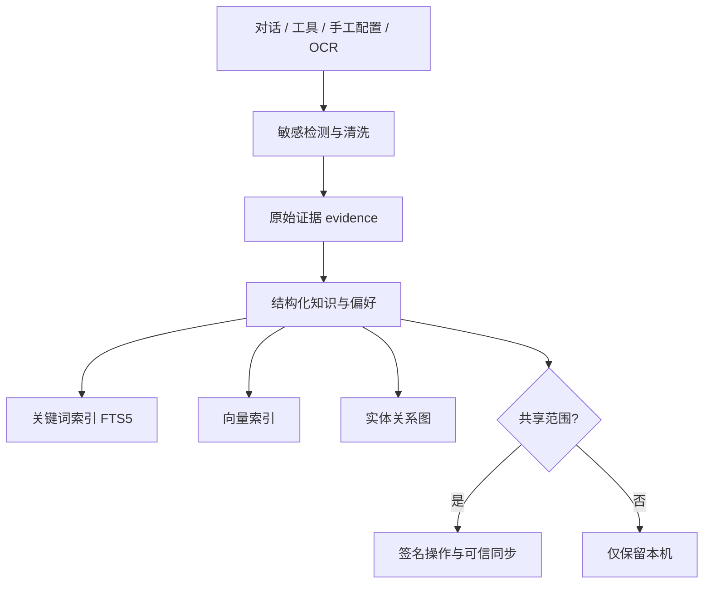
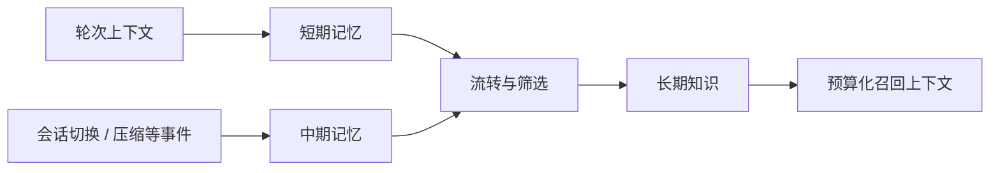

# 记忆如何工作

把信息存下来只是第一步。PIXIU 把来源、结构化知识、检索索引和设备副本连接起来，让信息可以查找、解释和更新。

## 从来源到知识

来源证据与知识条目分开保存。编辑知识可以创建新的证据关联，而不是覆盖原始输入的全部来历。

## 三路检索

| 通道     | 适合找什么             | 例子                       |
| -------- | ---------------------- | -------------------------- |
| 关键词   | 明确的标题、名称与词面 | 电费、项目名               |
| 向量     | 语义接近的表达         | 「怎么汇报」与「输出格式」 |
| 实体关系 | 已识别实体及其关系     | 供应商属于某支出类别       |

系统组合三路结果，按范围与条件过滤，再整理答案与来源。在线检索本身不依赖大语言模型生成；Agent 可以在召回结果上继续组织回复。

## 排名融合的直观表达

RRF（Reciprocal Rank Fusion）按各通道中的名次贡献分数：

$$
\operatorname{RRF}(d)=\sum_{c\in\mathcal{C}}\frac{1}{k+\operatorname{rank}_c(d)}
$$

这里 $d$ 是候选记忆，$\mathcal{C}$ 是召回通道，$k$ 是平滑项。公式解释融合思想，不是当前实现所有权重、重排与过滤的完整替代规格。

## 短期、中期与长期

生命周期事件提供短期或中期上下文；流转机制将适合保留的内容提升为长期知识。长期记忆不是把整段会话无限堆进模型提示词。

## 平台适配

麒麟原生路径调用系统 Embedding 和 Vector Engine。软件降级路径使用可移植向量器与 SQLite/INT8 等实现，保证核心路径可用，但不承诺同等检索质量或原生集成。

完整开发规格在[仓库架构文档](https://github.com/PlutoKeating/Project.PIXIU/blob/main/docs/ARCHITECTURE.md)。
