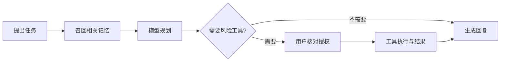

# 在 Agent 中工作

PIXIU 的桌面入口集成 openKylin Agent 与 Runtime。它们负责多轮会话、规划、工具执行和审批，PIXIU 通过 MemoryProvider 接入记忆生命周期。

## 从一个清楚的任务开始

新建会话后，说明目标、相关背景和输出要求。例如：

> 根据我保存的项目进展格式，帮我整理这段记录。先列结论，再给下一步。

先确认模型连接，再观察记忆来源。如果任务需要 Shell 或联网搜索，展开相应工作卡片查看真实执行过程。

## 阅读工作过程

| 界面内容     | 用途                     | 需要留意               |
| ------------ | ------------------------ | ---------------------- |
| 助手消息     | 阅读模型生成的答复       | 文本声明不等于工具成功 |
| 工具工作卡片 | 查看工具参数、进度和结果 | 失败与停止状态         |
| 记忆来源     | 核对召回事实的依据       | 是否符合当前范围       |
| 授权提示     | 决定是否允许风险动作     | 实际命令与影响对象     |

工作卡片默认折叠，可以展开。它们用于呈现执行事件，与模型答复内容分开保存。

## 停止与继续

运行期间可停止任务。停止表示请求中止后续工作，不保证撤销已完成的文件修改或外部操作。继续前阅读最近一张工作卡片，确认哪些动作已经发生。

## 会话和长期记忆

新建会话不会自动清空长期记忆。会话上下文与长期知识是不同层次；只有进入记忆服务的内容才属于 PIXIU 可管理的记忆。不要假设每一次工具结果都会自动成为有价值的长期知识。

下一步：[检索、编辑与证据](./memory)。
