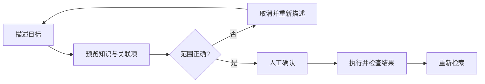

# 先看范围，再执行遗忘

用自然语言描述要忘记的内容，然后确认目标。遗忘应当可核对，不能把宽泛指令直接当作批量删除授权。

## 两个独立步骤

**第一步：预览。** 在桌面遗忘入口输入目标描述，检查列出的知识与关联项。若范围不准确，取消并重新描述。

**第二步：确认。** 只有在当前预览范围正确时确认执行。Agent 显式遗忘工具仅预览，执行需要桌面重新预览并由人确认。

## 试一次取消和确认

选择下面的「遗忘」。先预览并取消，再预览并确认，最后回到「找回」检查变化。

<MemoryDemo />

## 当前遗忘实际做什么

| 对象                          | 当前行为                       |
| ----------------------------- | ------------------------------ |
| 知识条目                      | 标记为已遗忘，从正常检索中隐藏 |
| 向量索引                      | 删除相应向量                   |
| 共享内容                      | 传播删除墓碑，等待可信设备收敛 |
| 原始 evidence、关系、FTS 载荷 | 仍可能保留，不承诺全部物理擦除 |

::: warning 关联数量是预览信息
界面中的证据或关联计数不代表那些原始记录已经被物理删除。若需要彻底的数据擦除，不应把当前遗忘功能视为等价能力。
:::

## 执行之后

在相同作用域重新检索，确认目标不再出现。共享场景还需让离线设备上线完成对账。执行失败或预览凭证过期时，重新预览并核对，不重复使用旧确认状态。
