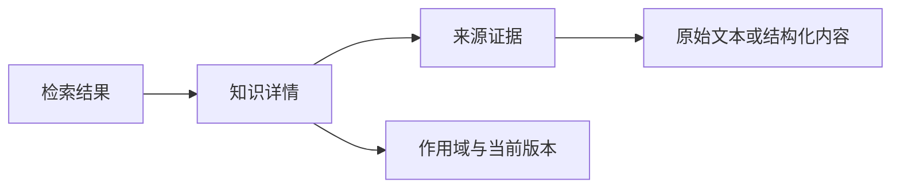

# 检索、编辑与证据

一条记忆应当既能找回，也能回答「这从哪里来」。先选择正确的范围，再开始检索或编辑。

## 检索一条记忆

1. 在记忆管理中选择私人或已配置的共享范围。
2. 输入自然语言关键词，例如「项目进展格式」。
3. 如果为空，减少时间限制，并换用原始内容中的实体或关键词。
4. 查看结果的内容、状态、置信度与来源。

置信度是检索信号，不是事实保证。金额、日期和规则等关键内容应进一步查看证据。

## 查看来源

知识条目是整理后的内容，evidence 是它关联的来源。打开证据详情后，先读可读正文，需要进一步排查时再展开结构化或原始数据。

## 编辑已有记忆

先读取完整详情，再修改标题或正文并保存。产品使用版本检查，避免陈旧页面悄悄覆盖别处的新内容。

| 结果               | 你的下一步                     |
| ------------------ | ------------------------------ |
| 保存成功           | 再检索，核对新内容与来源       |
| 版本冲突           | 重新读取最新详情，对照后再编辑 |
| 服务失败           | 保留输入，检查状态后重试       |
| 条目已遗忘或不可见 | 核对范围和条目状态             |

编辑会保持知识标识并新增来源记录、重建相关索引。不要把冲突后重复提交旧版本当作强制覆盖机制。

## 亲手看一次更正

选择「更正」，把金额改为任意合理数值；回到「找回」查看合计。网页演示不模拟数据库版本锁，只说明更正后的信息应该如何影响结果。

<MemoryDemo />
