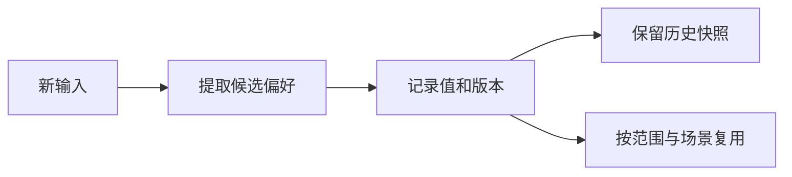

# 偏好与冲突

偏好表达「你希望怎么做」，知识表达「发生了什么」。两者都可能变化，因此需要查看形成依据和历史。

## 三类偏好

| 类型     | 示例               | 使用建议                 |
| -------- | ------------------ | ------------------------ |
| 操作习惯 | 先整理再执行       | 确认适用场景             |
| 输出风格 | 先结论、后待办     | 可用明确表述帮助提取     |
| 安全策略 | 执行风险动作前确认 | 不代替工具本身的授权机制 |

在偏好页选择范围，查看列表。提取完成后再查看结果，不能只凭提交成功认定已形成某个偏好。

## 查看历史

打开偏好历史，比较值、版本和时间。历史帮助你理解何时改变了表达方式，也方便排查旧偏好为何仍影响结果。当前手册不承诺历史列表提供一键回滚。

## 当知识互相矛盾

冲突页展示双方内容、裁决方式和时间。默认的新值优先策略会保留旧版本，便于审计；系统也有合并或待人工处理状态。

**看到人工处理状态不代表界面已经提供人工裁决按钮。** 先对照证据，依据当前版本实际提供的编辑入口更正，勿把未实现的交互当作可用功能。

## 同步冲突与语义冲突

同一条记忆的两个离线副本由同步机制处理；不同条目表达矛盾事实则由业务冲突仲裁处理。这是两个层次。完成网络同步后，仍需检查最终业务内容是否符合证据。
