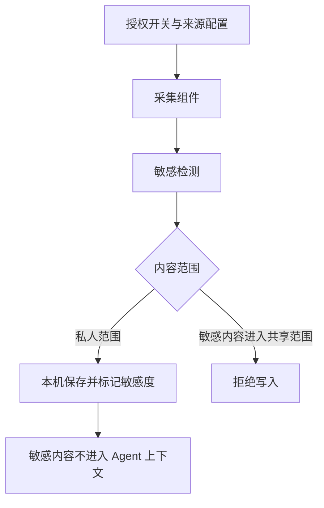

# 采集与隐私

在「设置 → 采集与隐私」管理采集来源、目录和日志。首次配置的总开关与来源开关默认关闭，目录为空；后台组件启动不等于你已经授权采集。

## 按需开启来源

1. 先读取当前设置。
2. 选择明确需要的目录或来源。
3. 检查开关与范围，再保存。
4. 查看采集日志确认实际结果。

选择目录只修改设置草稿，不会因为浏览了目录就开始采集。保存成功也不单独证明监视器已成功应用配置。

| 来源             | 当前边界                                   |
| ---------------- | ------------------------------------------ |
| 目录文本         | 非递归监视，检查稳定性后读取               |
| 目录图片         | 依赖 OCR 适配；无 SDK 时不能宣称识别成功   |
| 应用行为         | X11 路径依赖 xprop，不代表全面覆盖 Wayland |
| 剪贴板、自动截图 | 当前未实现，不应视为可用来源               |

## 查看日志

日志包括时间、来源、状态、摘要与关联标识。出现失败先查看状态，再核对权限和来源能力。日志摘要可能含文件名，复制到公开反馈前需要检查内容。

## 敏感标记不等于未保存

私人内容可能已在本机保存，并被标记为敏感；它不会因此自动进入独立隔离库，也不等于已物理删除。共享写入的敏感内容会被拒绝，检测异常时采取拒绝处理。

关闭采集不能保证已在途的写入全部撤销。关闭后检查日志，必要时再对具体条目执行[预览与遗忘](./forget)。

## 洞察与简报

「记忆 → 洞察与简报」提供本机个人范围内的候选与按日聚合摘要。当前洞察不是完整偏好学习面板；摘要可能包含标题或正文片段，不是完全无原文的统计报告。
