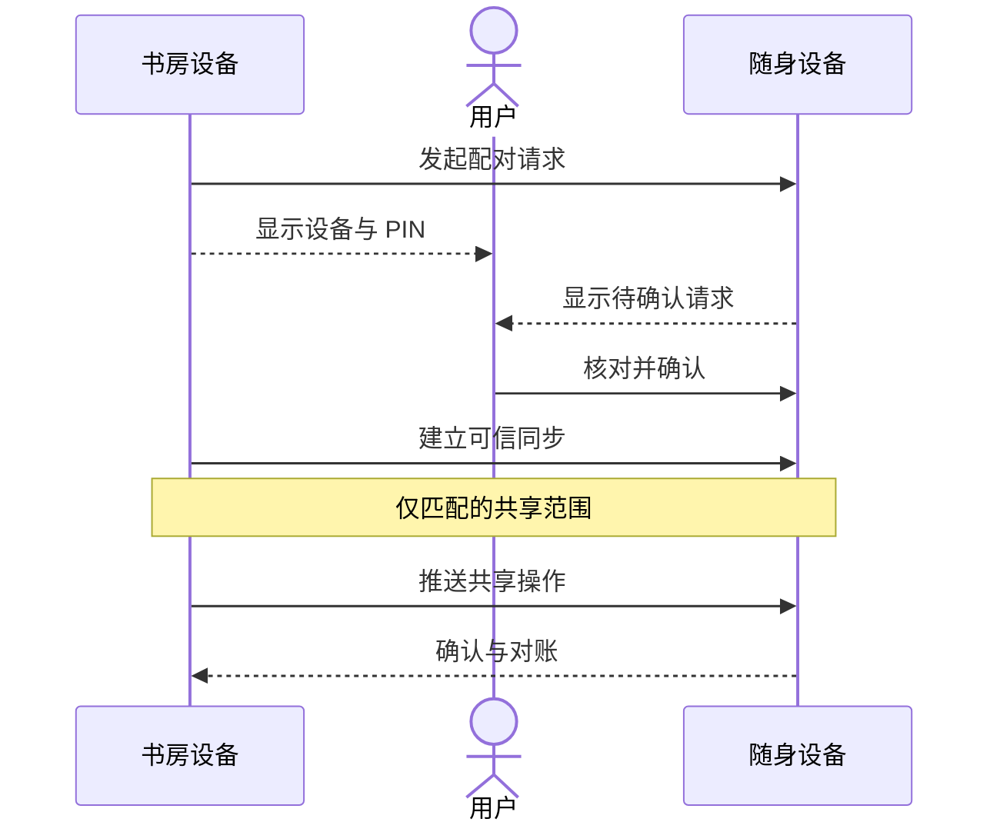
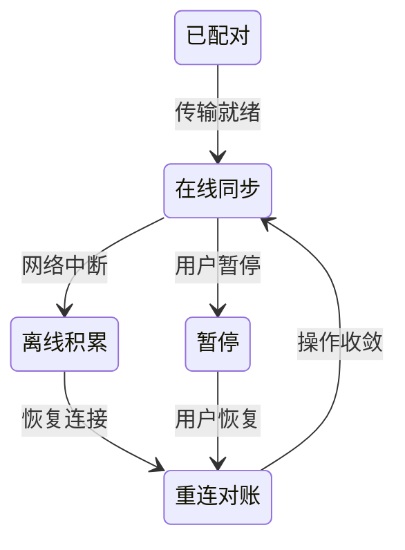

# 让可信设备共享记忆

同步让共享内容在设备之间流转。私人范围 `user:…` 保留本机；只有配置匹配的 `shared:…` 范围进入同步。

## 1. 准备两台设备

在设备上安装相互兼容的软件包，确保处于可互访网络，同步未关闭，必要的身份、证书和传输配置就绪。允许本机网络组件运行不代表已建立可信配对。

## 2. 双方确认配对

1. 在设备 A 的「同步与设备」发起配对请求。
2. 在设备 B 核对名称和六位 PIN。
3. 双方确认，检查节点列表是否出现可信连接。
4. 先用一条无敏感内容的共享记忆验证，再用于日常内容。

## 3. 验证实际同步

在 A 写入一条带有易识别标题的共享测试记忆。在 B 选择同一共享范围，检索并查看来源。只看到节点在线，不足以证明该条记忆已同步。

| 状态 | 含义         | 检查                   |
| ---- | ------------ | ---------------------- |
| 在线 | 当前可连接   | 是否可信、队列是否处理 |
| 离线 | 暂不可达     | 本地仍可操作，等重连   |
| 暂停 | 暂停同步活动 | 恢复后重新检查队列     |
| 积压 | 有待传递操作 | 网络、身份与对账状态   |

## 离线与重连

离线设备只持有上次同步后的本地副本。重连后通过增量推送和周期对账补齐变化。这个过程是最终一致，不保证每台设备在任何时刻看到完全相同的内容。

## 解绑与遗忘

解绑撤销设备信任，不承诺远程擦除对方已持有的数据。共享记忆遗忘会产生墓碑，在对方恢复在线并完成同步后影响其可见性。具体数据保留边界见[安全遗忘](./forget)。
