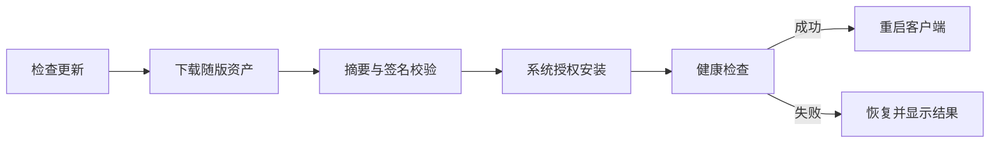

# 更新与恢复

[版本记录](/releases)在线展示发布者的更新说明；[下载页](/download)读取当前公开正式版。手册不维护一份独立的版本或附件清单。

## 在桌面应用中更新

打开「设置 → 关于与更新」，核对当前版本、可用更新和组件兼容状态。阅读说明后再执行更新。

## 校验为什么分两层

摘要用于核对文件完整性；签名用于核对清单来源。不要把网页显示的附件名或 SHA-256 文本当作浏览器已经替你完成了安装包签名验证。

正式更新应使用同版的软件包、摘要与签名资产，不要从两个发布版本拼凑。

## 更新失败时

1. 阅读明确的失败阶段：下载、校验、授权、安装或健康检查。
2. 查看界面显示的恢复结果。
3. 恢复状态未确认前，避免继续写入重要数据。
4. 若状态不明，记录错误并查看服务日志，参考[故障排查](../reference/troubleshooting)。

更新流程设计包含原包、配置、数据库和同步身份备份。具体包的恢复结果必须通过当前环境的真实状态核对，不应仅凭进度条完成判断。

## 官网无法获取版本

官网直接请求 GitHub 公开 API。没有公开正式版、网络不可达或 API 限流时，页面会显示原因与重试入口，不用固定版本或备用安装链接填充。可以前往页面提供的 GitHub 原始记录核对。
