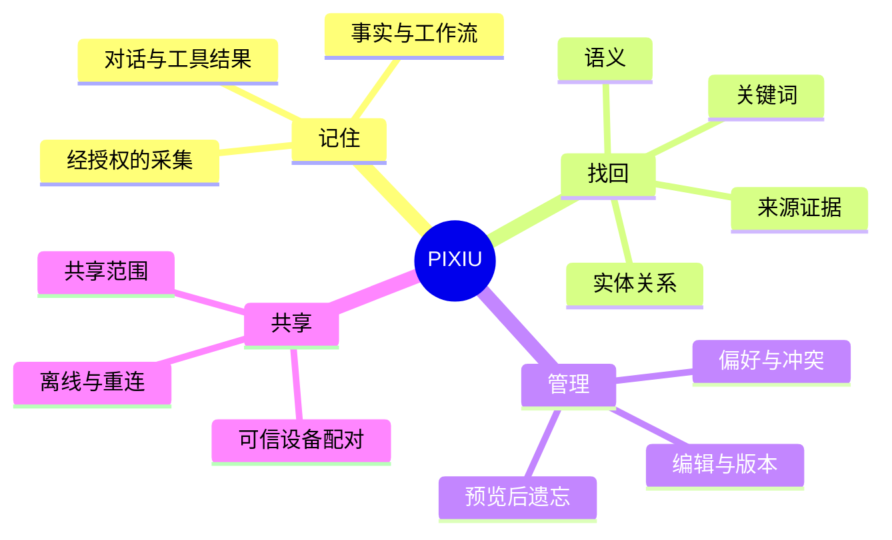

# 让 Agent 的下一次对话，从记得开始

PIXIU（貔貅）是一套面向银河麒麟的**去中心化 Agent 记忆系统**。它把事实、偏好、工作流与来源保存为可检索的记忆，并在可信设备之间同步你选择共享的内容。

桌面入口由集成了 PIXIU 的 openKylin Agent 宿主承载。会话、规划与工具由宿主和 Runtime 提供，PIXIU 负责记忆接入、检索、管理与共享。

## 先体验一段记忆

从左侧依次选择「记住 → 找回 → 更正 → 遗忘」。你可以修改燃气费，再查看合计如何变化。

<MemoryDemo />

## 选择你的起点

| 你想做什么             | 从这里开始                                                              |
| ---------------------- | ----------------------------------------------------------------------- |
| 第一次安装             | [安装与启动](./start/install) → [连接模型](./start/models)              |
| 让 Agent 记住一件事    | [第一次记忆](./start/first-memory)                                      |
| 检查答案从哪里来       | [检索、编辑与证据](./guide/memory)                                      |
| 在家里或办公室共享     | [多设备同步](./guide/sync)                                              |
| 决定什么被采集、被保留 | [采集与隐私](./guide/privacy) → [安全遗忘](./guide/forget)              |
| 了解机制或开发集成     | [记忆如何工作](./concepts/architecture) → [API 与配置](./reference/api) |

## 一张图理解能力边界

## 平台与联网

**银河麒麟桌面操作系统 V11 是优先平台。** 原生路径使用系统 Embedding 与 Vector Engine。Debian 系环境保留软件降级路径，用于核心记忆写入与检索；原生桌面集成、OCR 和检索质量可能不同。

本地记忆服务不需要云端账号，断网仍可进行基本写入和检索。Agent 的模型推理与联网搜索依赖所选服务和网络。跨设备同步需要设备可互访、身份与传输配置就绪。

::: info 阅读演示的边界
本手册的网页演示和图表用于说明操作逻辑。当前仓库没有可复用的已验收桌面实拍；这些内容不作为银河麒麟实机、多设备或性能验收证据。功能入口以所安装版本为准。
:::
