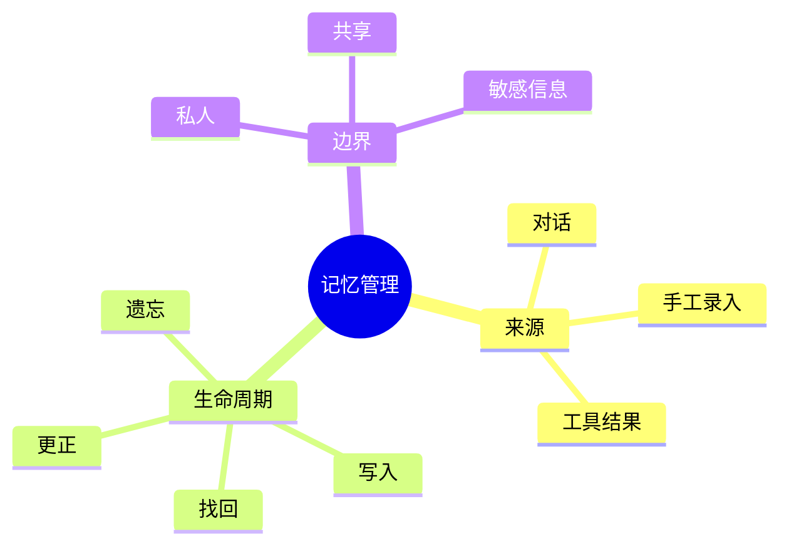
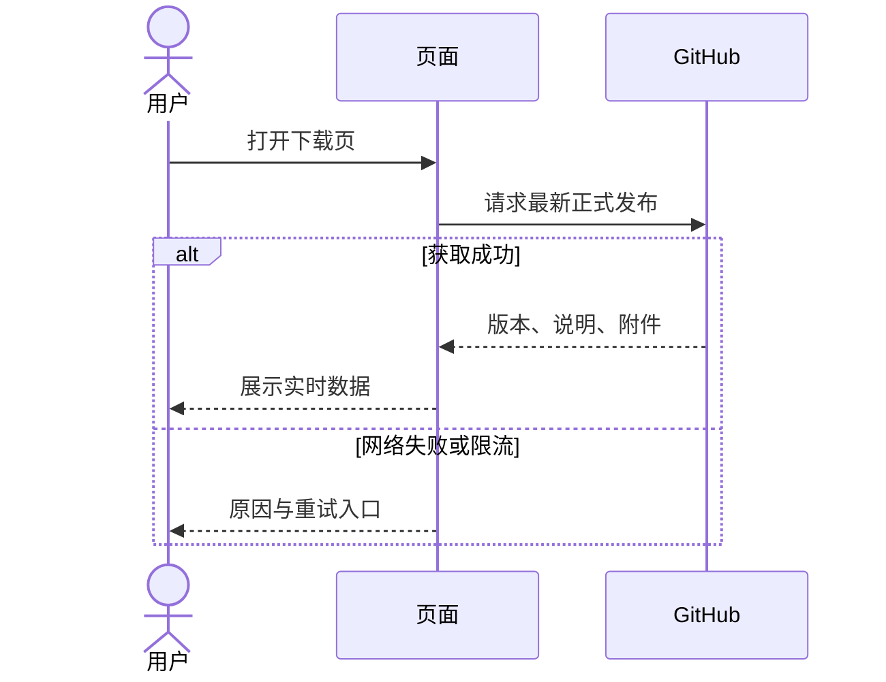

# 不只有文字的手册

本文既是渲染示例，也是后续维护文档的写作参考。文档使用 Markdown，必要时嵌入可交互 Vue 组件。

## 表格与任务列表

| 表达内容   | 推荐方式       |
| ---------- | -------------- |
| 顺序操作   | 编号步骤       |
| 多方案对比 | 表格           |
| 状态变化   | Mermaid 状态图 |
| 调用关系   | 时序图         |
| 概念分类   | 思维导图       |

- [x] 核对记忆范围
- [x] 查看来源
- [ ] 在真实设备验证操作结果

## 数学公式

行内表达：$S=\sum_{i=1}^{n}a_i$。独立公式：

$$
S = 210 + 68.50 + 156 = 434.50
$$

公式在构建时通过 MathJax 渲染，不需要从远程 CDN 加载数学字体脚本。

## 思维导图



Mermaid 在需要时加载包内代码。图表下方保留可展开源码，无法绘制时仍能阅读结构。

## 时序图



## 代码组与提示

::: code-group

```bash [开发]
npm run dev
```

```bash [构建]
npm run build
```

:::

::: tip 让图表服务阅读
图表解释关系，步骤说明操作。不要用复杂图表替代一句能说清楚的话。
:::

::: details 阅读维护说明
Markdown 支持语法高亮、代码复制、标题锚点、表格、脚注、提示块和 Vue 交互组件。发布说明单独按不可信 Markdown 渲染，不执行 HTML 或 Vue。
:::

## 脚注与引用

示例内容使用合成数据[^demo]，不包含用户真实记忆。

[^demo]: 合成数据用于解释操作流程，不作为软件实机测试证据。
