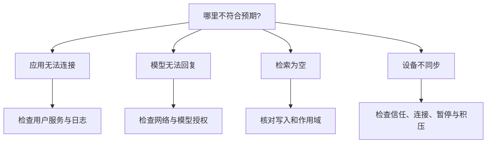

# 故障排查

按「服务 → 模型 → 范围 → 同步」的顺序缩小问题，通常比重装更容易保留线索。

## 快速定位



## 后端连接失败

先读取状态与日志：

```bash
systemctl --user status pixiu-backend.service
journalctl --user -u pixiu-backend.service -n 100 --no-pager
```

确认原因并修正配置后，再执行：

```bash
systemctl --user restart pixiu-backend.service
```

严格原生画像缺少 SDK 时可能在启动预检失败。不要只为消除错误而把严格画像改成软件降级，然后称原生能力已就绪。

## 检索或来源不符合预期

| 现象         | 检查顺序                                           |
| ------------ | -------------------------------------------------- |
| 完全没有结果 | 写入是否成功 → 作用域一致 → 时间限制 → 关键词      |
| 找到旧内容   | 编辑是否成功 → 版本冲突 → 当前状态                 |
| 没有证据     | 查看写入响应与关联状态，勿把无来源答案当成核验结果 |
| OCR 不可用   | 检查原生 OCR 服务；无 SDK 的错误不等于图片无文字   |

## 多设备没有收敛

核对配对信任、同步开关、暂停状态、设备时钟与网络。确认共享范围一致，等待离线设备恢复。每台设备都重新检索同一测试条目，不能只检查「在线」字样。

## 官网下载列表为空或失败

官网需要浏览器访问 GitHub 公共 API。未发布、仓库不可见、网络超时或限流会有对应提示。使用重试或前往 GitHub 核对；网站不会提供猜测的版本和备用包地址。

## 提交有效反馈

记录操作步骤、预期和实际结果，以及应用版本、系统平台与失败阶段。若附截图或日志，先移除密钥、私人内容、设备配对凭据等信息。

[到 GitHub 查看或提交问题](https://github.com/PlutoKeating/Project.PIXIU/issues)。
