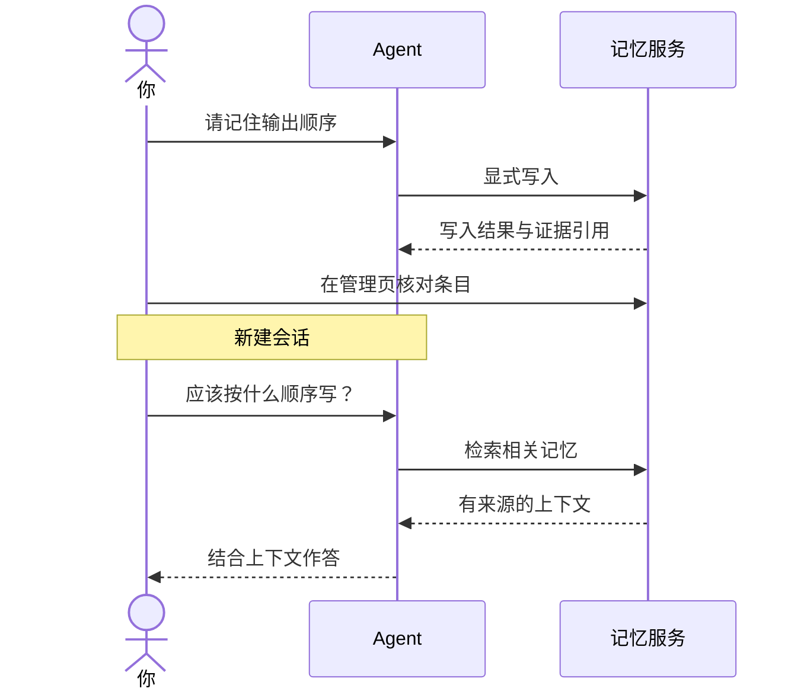

# 第一次记忆

用一条不含隐私的工作偏好，完成「保存 → 换会话 → 找回 → 查看来源」。示例文本可替换，实际结果取决于当前版本、模型与服务状态。

## 1. 明确告诉 Agent 要记住什么

新建会话，输入：

> 请记住：整理项目进展时，先给结论，再列出待办。

观察记忆工具的实际执行结果。模型说「记住了」本身不证明写入成功；展开工作过程，核对是否调用了记忆工具、是否返回成功结果。

## 2. 在管理页核对

进入记忆管理，选择与刚才操作一致的私人范围，检索「项目进展」。找到条目后打开来源，确认内容确实是你的输入，未被误记成其他事实。

## 3. 在新会话中复用

新建另一个会话：

> 我准备整理项目进展，应该按什么顺序写？

核对召回内容和来源。如果没有找到，先检查是否在同一范围，再查看[故障排查](../reference/troubleshooting)。不要通过重复写入大量相同条目来掩盖检索问题。

## 4. 体验更正与遗忘

下面的网页练习独立于桌面产品。选择「更正」修改金额，然后在「找回」查看合计；选择「遗忘」先预览，再确认。刷新页面会重置练习。

<MemoryDemo />

下一步：[检索、编辑与证据](../guide/memory)。
