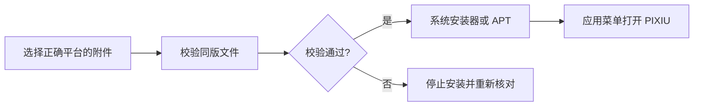

# 安装与启动

先核对操作系统与 CPU 架构，再选择发布者提供的安装附件。

## 1. 获取适合当前设备的附件

打开[下载页面](/download)。版本、说明、文件名、大小与下载地址均现场读取 GitHub。阅读该版本说明中的平台要求，不要把不同版本或不同架构的附件混用。

在终端查看架构：

```bash
dpkg --print-architecture
```

银河麒麟 V11 原生使用前，在系统「AI 模块管理」中确认相应能力已启用。Debian 软件降级不等于麒麟原生能力，具体安装包支持的平台以随版说明为准。

## 2. 校验与安装

下载软件包及其同版校验附件。在下载目录中，使用实际下载的文件名替换下面的占位名称：

```bash
sha256sum -c '<下载的软件包文件名>.sha256'
sudo apt install './<下载的软件包文件名>.deb'
```

SHA-256 用于检查文件完整性，不独立证明发布者身份。客户端升级还会检查同版签名清单，参见[更新与恢复](../guide/updates)。不要忽略校验失败后继续安装。

如果更习惯图形界面，可以双击 `.deb`，由系统软件安装器完成安装与授权。



## 3. 打开 PIXIU

从应用菜单启动 **PIXIU**，或执行：

```bash
pixiu
```

首次启动会初始化当前用户的配置、数据库、后台服务和 MemoryProvider。它使用桌面用户会话，不需要以 root 身份运行应用。

接下来进入[连接模型](./models)，再完成[第一次记忆](./first-memory)。

## 4. 确认服务就绪

出现连接问题时，可检查：

```bash
systemctl --user status pixiu-backend.service
curl --fail http://127.0.0.1:8765/health
curl --fail http://127.0.0.1:8765/capabilities
```

`/health` 检查数据库与后端就绪状态；`/capabilities` 描述实际运行的 Embedding 和 Vector Store。配置意图 `configured` 与实际适配器 `runtime` 可能不同。

## 数据保存在哪里

| 内容       | 默认位置（未设置 XDG 变量时）   |
| ---------- | ------------------------------- |
| 用户配置   | `~/.config/pixiu/pixiu.env`     |
| 记忆数据库 | `~/.local/share/pixiu/pixiu.db` |
| 运行状态   | `~/.local/state/pixiu/`         |

模型密钥由 Runtime 管理，不应写入记忆、截图或公开日志。普通卸载 `sudo apt remove pixiu` 会保留用户数据；卸载软件和删除个人数据是不同操作。
