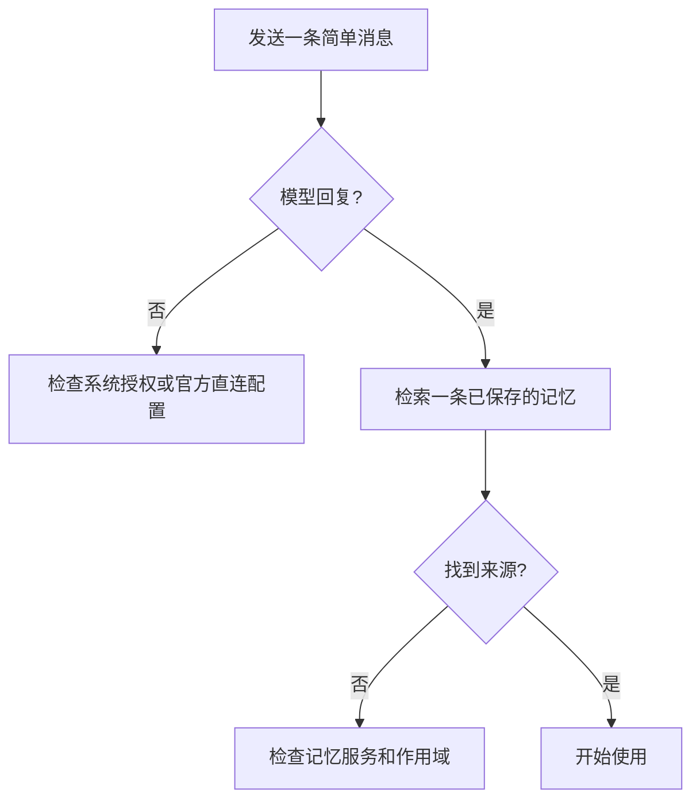

# 连接模型

记忆服务与模型推理是两条独立链路。服务就绪不意味着云模型已经授权；模型能回复也不意味着记忆服务已经连接。

## 银河麒麟：系统云模型

保持默认的「麒灵系统云模型」。PIXIU 使用系统「AI 模块管理」中的首选模型与授权，不需要把同一份 API Key 再交给 PIXIU。

1. 在系统设置确认模型可用与授权状态。
2. 打开 PIXIU，新建会话。
3. 发送一个不涉及工具的简短问题，先确认模型能正常回复。
4. 再尝试[记住与找回](./first-memory)。

## 使用自己的官方直连服务

在「云端模型设置」选择支持的服务商，填写模型 ID、API 地址与 API Key，点击「检测并保存」。当前手册所依据的集成提供 DeepSeek、Anthropic 和 OpenAI 官方直连配置。

| 项目     | 填写依据             | 检查方式           |
| -------- | -------------------- | ------------------ |
| 服务商   | 你实际开通的服务     | 与凭据所属服务一致 |
| 模型 ID  | 服务商给出的模型标识 | 账户有访问权限     |
| API 地址 | 服务商官方端点       | 协议和路径匹配     |
| API Key  | 自己的凭据           | 连接检测通过       |

不要将密钥保存到记忆里，也不要把包含凭据的画面提交到问题反馈中。

## 如何定位连接问题

## 离线时的区别

离线可用指本地核心记忆写入与检索。云模型、联网搜索及尚未同步到本机的远端信息不会因此变为离线可用。遇到模型错误时，先检查网络和模型授权，不要直接删除记忆数据库。
